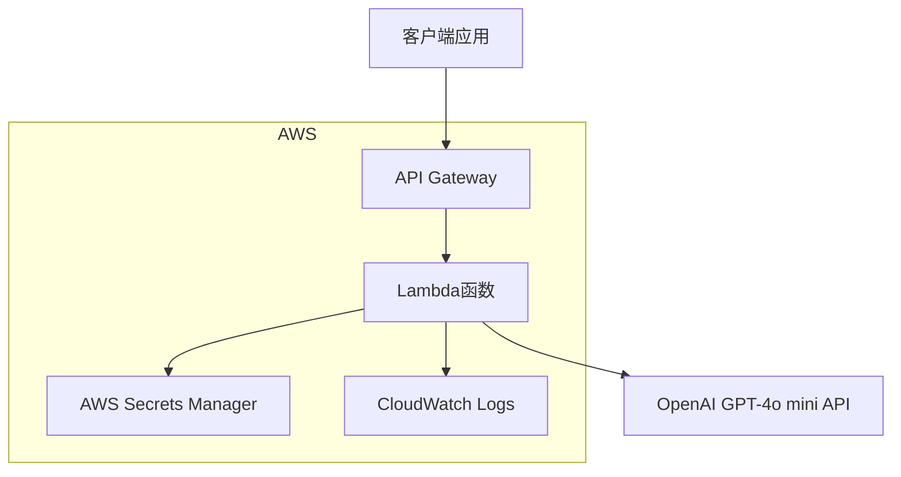
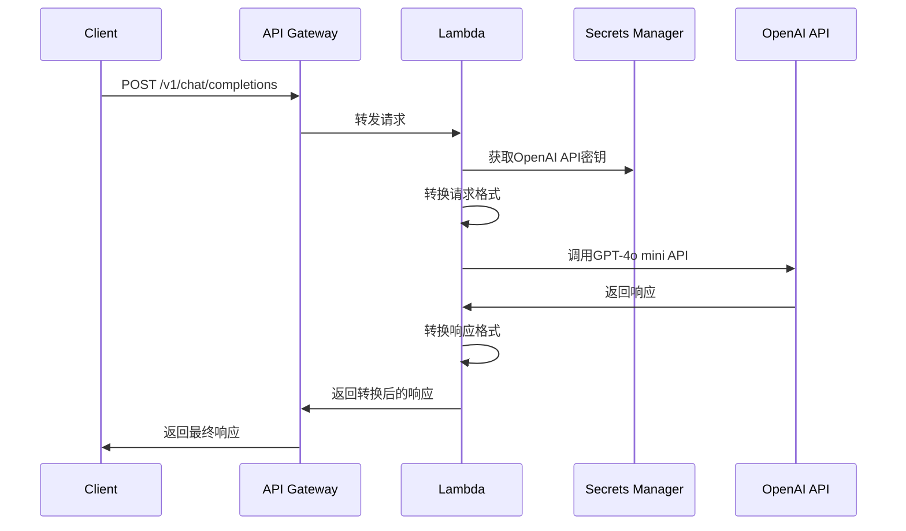

# Design Document

## Overview

本设计文档描述了一个API Gateway + Lambda代理服务的架构，该服务将AWS Nova Lite API调用转换为OpenAI GPT-4o mini API调用。代理服务将保持与现有Bedrock代理相同的OpenAI兼容接口，但将后端从AWS Bedrock切换到OpenAI API。

### 核心设计原则

1. **接口兼容性**: 保持与现有OpenAI兼容API的完全兼容
2. **无缝切换**: 客户端无需修改代码即可从Nova Lite切换到GPT-4o mini
3. **高可用性**: 利用AWS Lambda的自动扩展和API Gateway的高可用性
4. **安全性**: 实现适当的认证和授权机制
5. **可观测性**: 提供完整的日志记录和监控能力

## Architecture

### 高层架构图



### 请求流程



## Components and Interfaces

### 1. API Gateway

**职责:**
- 接收客户端HTTP请求
- 执行请求验证和认证
- 路由请求到Lambda函数
- 返回响应给客户端

**配置:**
- 支持CORS跨域请求
- 实现API密钥认证
- 配置请求/响应转换
- 设置超时和限流

**端点设计:**
```
POST /v1/chat/completions - 聊天完成API
GET /v1/models - 模型列表API
POST /v1/embeddings - 嵌入API（可选）
GET /health - 健康检查端点
```

### 2. Lambda函数

**职责:**
- 接收API Gateway转发的请求
- 执行请求格式转换
- 调用OpenAI API
- 处理响应格式转换
- 错误处理和日志记录

**核心模块:**

#### 2.1 请求处理器 (RequestHandler)
```python
class RequestHandler:
    def handle_chat_completion(self, event: dict) -> dict
    def handle_models_list(self, event: dict) -> dict
    def handle_health_check(self, event: dict) -> dict
```

#### 2.2 格式转换器 (FormatConverter)
```python
class FormatConverter:
    def bedrock_to_openai_request(self, bedrock_request: dict) -> dict
    def openai_to_bedrock_response(self, openai_response: dict) -> dict
    def convert_model_name(self, model_name: str) -> str
```

#### 2.3 OpenAI客户端 (OpenAIClient)
```python
class OpenAIClient:
    def __init__(self, api_key: str)
    def chat_completion(self, request: dict) -> dict
    def list_models(self) -> dict
```

#### 2.4 配置管理器 (ConfigManager)
```python
class ConfigManager:
    def get_openai_api_key(self) -> str
    def get_model_mapping(self) -> dict
    def get_timeout_settings(self) -> dict
```

### 3. AWS Secrets Manager

**职责:**
- 安全存储OpenAI API密钥
- 提供密钥轮换功能
- 支持细粒度访问控制

**密钥结构:**
```json
{
  "openai_api_key": "sk-...",
  "model_mappings": {
    "amazon.nova-lite-v1:0": "gpt-4o-mini",
    "amazon.nova-pro-v1:0": "gpt-4o-mini"
  }
}
```

## Data Models

### 请求转换映射

#### Nova Lite请求格式 → GPT-4o mini请求格式

**消息转换:**
```python
# Nova Lite格式 (Bedrock Converse API)
{
    "modelId": "amazon.nova-lite-v1:0",
    "messages": [
        {
            "role": "user",
            "content": [{"text": "Hello"}]
        }
    ],
    "inferenceConfig": {
        "temperature": 0.7,
        "maxTokens": 1000,
        "topP": 0.9
    }
}

# 转换为GPT-4o mini格式
{
    "model": "gpt-4o-mini",
    "messages": [
        {
            "role": "user", 
            "content": "Hello"
        }
    ],
    "temperature": 0.7,
    "max_tokens": 1000,
    "top_p": 0.9
}
```

**参数映射表:**
| Bedrock参数 | OpenAI参数 | 转换规则 |
|------------|-----------|---------|
| modelId | model | 使用模型映射表 |
| inferenceConfig.temperature | temperature | 直接映射 |
| inferenceConfig.maxTokens | max_tokens | 直接映射 |
| inferenceConfig.topP | top_p | 直接映射 |
| inferenceConfig.stopSequences | stop | 直接映射 |

### 响应转换映射

#### GPT-4o mini响应格式 → Nova Lite响应格式

```python
# GPT-4o mini响应
{
    "id": "chatcmpl-...",
    "object": "chat.completion",
    "created": 1234567890,
    "model": "gpt-4o-mini",
    "choices": [
        {
            "index": 0,
            "message": {
                "role": "assistant",
                "content": "Hello! How can I help you?"
            },
            "finish_reason": "stop"
        }
    ],
    "usage": {
        "prompt_tokens": 10,
        "completion_tokens": 20,
        "total_tokens": 30
    }
}

# 转换为Bedrock兼容格式（保持OpenAI格式）
# 无需转换，直接返回
```

## Error Handling

### 错误分类和处理策略

#### 1. 客户端错误 (4xx)
- **400 Bad Request**: 请求格式错误
- **401 Unauthorized**: 认证失败
- **429 Too Many Requests**: 请求限流

**处理策略:**
```python
def handle_client_error(error_code: int, message: str) -> dict:
    return {
        "error": {
            "message": message,
            "type": "invalid_request_error",
            "code": error_code
        }
    }
```

#### 2. 服务器错误 (5xx)
- **500 Internal Server Error**: Lambda函数内部错误
- **502 Bad Gateway**: OpenAI API调用失败
- **504 Gateway Timeout**: 请求超时

**处理策略:**
```python
def handle_server_error(error_code: int, message: str) -> dict:
    logger.error(f"Server error {error_code}: {message}")
    return {
        "error": {
            "message": "Internal server error",
            "type": "server_error", 
            "code": error_code
        }
    }
```

#### 3. OpenAI API错误处理
```python
def handle_openai_error(openai_error: dict) -> dict:
    # 将OpenAI错误格式转换为Bedrock兼容格式
    return {
        "error": {
            "message": openai_error.get("message", "Unknown error"),
            "type": openai_error.get("type", "api_error"),
            "code": openai_error.get("code", "unknown")
        }
    }
```

### 重试机制

```python
@retry(
    stop=stop_after_attempt(3),
    wait=wait_exponential(multiplier=1, min=4, max=10),
    retry=retry_if_exception_type(requests.exceptions.RequestException)
)
def call_openai_api(request_data: dict) -> dict:
    # OpenAI API调用逻辑
    pass
```

## Testing Strategy

### 1. 单元测试

**测试覆盖范围:**
- 请求格式转换函数
- 响应格式转换函数
- 错误处理逻辑
- 配置管理功能

**测试框架:** pytest

**示例测试:**
```python
def test_bedrock_to_openai_request_conversion():
    converter = FormatConverter()
    bedrock_request = {
        "modelId": "amazon.nova-lite-v1:0",
        "messages": [{"role": "user", "content": [{"text": "Hello"}]}]
    }
    
    openai_request = converter.bedrock_to_openai_request(bedrock_request)
    
    assert openai_request["model"] == "gpt-4o-mini"
    assert openai_request["messages"][0]["content"] == "Hello"
```

### 2. 集成测试

**测试场景:**
- Lambda函数与API Gateway集成
- Lambda函数与Secrets Manager集成
- Lambda函数与OpenAI API集成
- 端到端请求响应流程

**测试工具:** AWS SAM CLI, LocalStack

### 3. 性能测试

**测试指标:**
- 响应时间 (< 5秒)
- 并发处理能力 (1000 req/min)
- 错误率 (< 1%)

**测试工具:** Artillery, AWS X-Ray

### 4. 安全测试

**测试内容:**
- API密钥验证
- 输入验证和清理
- 敏感信息泄露检查
- CORS配置验证

## Deployment Architecture

### Infrastructure as Code

使用AWS CDK或CloudFormation定义基础设施：

```yaml
# CloudFormation模板结构
Resources:
  # API Gateway
  ProxyApi:
    Type: AWS::ApiGateway::RestApi
    
  # Lambda函数
  ProxyFunction:
    Type: AWS::Lambda::Function
    
  # IAM角色和策略
  LambdaExecutionRole:
    Type: AWS::IAM::Role
    
  # Secrets Manager
  OpenAIApiKeySecret:
    Type: AWS::SecretsManager::Secret
```

### 环境配置

**开发环境:**
- 使用测试用的OpenAI API密钥
- 启用详细日志记录
- 较低的超时设置

**生产环境:**
- 使用生产OpenAI API密钥
- 优化的日志级别
- 生产级超时和重试设置

### 监控和告警

**CloudWatch指标:**
- Lambda函数调用次数
- 错误率
- 响应时间
- OpenAI API调用成功率

**告警设置:**
- 错误率超过5%
- 平均响应时间超过10秒
- Lambda函数失败率超过1%