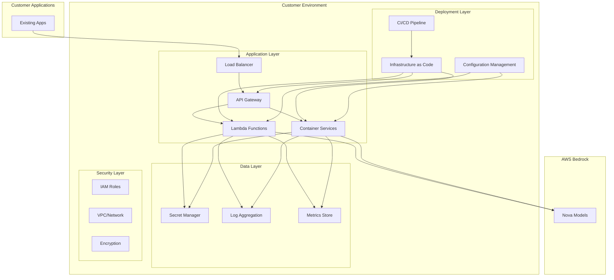

# Design Document: Customer Environment Deployment

## Overview

This design document outlines the architecture and implementation approach for deploying the Bedrock Nova Proxy service in customer environments. The solution provides flexible deployment options, comprehensive security controls, and seamless integration with existing customer infrastructure.

## Architecture

### High-Level Architecture



### Deployment Options

#### Option 1: Serverless Deployment (Recommended)
- **Components**: API Gateway + Lambda
- **Best for**: Most customer environments, cost-effective
- **Scaling**: Automatic, pay-per-use
- **Maintenance**: Minimal

#### Option 2: Container Deployment
- **Components**: ECS/EKS + Application Load Balancer
- **Best for**: High-throughput environments, existing container infrastructure
- **Scaling**: Configurable auto-scaling
- **Maintenance**: Moderate

#### Option 3: Hybrid Deployment
- **Components**: Mix of serverless and containers
- **Best for**: Complex environments with varying workloads
- **Scaling**: Flexible per component
- **Maintenance**: Variable

## Components and Interfaces

### 1. Deployment Automation

#### Infrastructure as Code (IaC)
```yaml
# CloudFormation Template Structure
AWSTemplateFormatVersion: '2010-09-09'
Description: 'Bedrock Nova Proxy - Customer Deployment'

Parameters:
  Environment:
    Type: String
    Default: 'prod'
    AllowedValues: ['dev', 'staging', 'prod']
  
  CustomerVPCId:
    Type: String
    Description: 'Customer VPC ID (optional)'
    Default: ''
  
  CustomerSubnetIds:
    Type: CommaDelimitedList
    Description: 'Customer Subnet IDs (optional)'
    Default: ''
  
  DeploymentType:
    Type: String
    Default: 'serverless'
    AllowedValues: ['serverless', 'container', 'hybrid']

Resources:
  # API Gateway
  # Lambda Functions
  # IAM Roles
  # CloudWatch Resources
  # Security Groups
```

#### Terraform Alternative
```hcl
# terraform/main.tf
variable "customer_config" {
  description = "Customer-specific configuration"
  type = object({
    environment     = string
    vpc_id         = optional(string)
    subnet_ids     = optional(list(string))
    deployment_type = string
  })
}

module "bedrock_nova_proxy" {
  source = "./modules/bedrock-nova-proxy"
  
  customer_config = var.customer_config
  
  # Customer-specific overrides
  custom_domain      = var.custom_domain
  ssl_certificate    = var.ssl_certificate
  monitoring_config  = var.monitoring_config
}
```

### 2. Configuration Management

#### Environment Configuration
```yaml
# config/environments/customer-prod.yaml
environment: production
customer:
  name: "Customer Name"
  region: "us-east-1"
  account_id: "123456789012"

deployment:
  type: "serverless"
  vpc:
    enabled: true
    vpc_id: "vpc-12345678"
    subnet_ids: ["subnet-12345678", "subnet-87654321"]
  
security:
  encryption:
    enabled: true
    kms_key_id: "arn:aws:kms:us-east-1:123456789012:key/12345678-1234-1234-1234-123456789012"
  
  iam:
    cross_account_role: "arn:aws:iam::123456789012:role/BedrockNovaProxyRole"
    
monitoring:
  cloudwatch:
    enabled: true
    log_group: "/aws/lambda/customer-bedrock-nova-proxy"
    retention_days: 30
  
  custom_metrics:
    enabled: true
    namespace: "Customer/BedrockNovaProxy"

models:
  mappings:
    "gpt-4o": "amazon.nova-pro-v1:0"
    "gpt-4o-mini": "amazon.nova-lite-v1:0"
    "gpt-3.5-turbo": "amazon.nova-micro-v1:0"
    "customer-model": "amazon.nova-premier-v1:0"
```

### 3. Security Framework

#### IAM Policy Template
```json
{
  "Version": "2012-10-17",
  "Statement": [
    {
      "Sid": "BedrockAccess",
      "Effect": "Allow",
      "Action": [
        "bedrock:InvokeModel",
        "bedrock:InvokeModelWithResponseStream",
        "bedrock:ListFoundationModels"
      ],
      "Resource": [
        "arn:aws:bedrock:*::foundation-model/amazon.nova-*"
      ]
    },
    {
      "Sid": "CloudWatchLogs",
      "Effect": "Allow",
      "Action": [
        "logs:CreateLogGroup",
        "logs:CreateLogStream",
        "logs:PutLogEvents"
      ],
      "Resource": "arn:aws:logs:*:*:log-group:/aws/lambda/customer-*"
    },
    {
      "Sid": "SecretsManager",
      "Effect": "Allow",
      "Action": [
        "secretsmanager:GetSecretValue"
      ],
      "Resource": "arn:aws:secretsmanager:*:*:secret:customer/bedrock-nova-proxy/*"
    }
  ]
}
```

#### Network Security
```yaml
# Security Group Configuration
SecurityGroups:
  LambdaSecurityGroup:
    Type: AWS::EC2::SecurityGroup
    Properties:
      GroupDescription: Security group for Bedrock Nova Proxy Lambda
      VpcId: !Ref CustomerVPC
      SecurityGroupEgress:
        - IpProtocol: tcp
          FromPort: 443
          ToPort: 443
          CidrIp: 0.0.0.0/0
          Description: HTTPS outbound for Bedrock API
        - IpProtocol: tcp
          FromPort: 53
          ToPort: 53
          CidrIp: 0.0.0.0/0
          Description: DNS resolution
```

### 4. Monitoring and Observability

#### CloudWatch Dashboard Template
```json
{
  "widgets": [
    {
      "type": "metric",
      "properties": {
        "metrics": [
          ["Customer/BedrockNovaProxy", "RequestCount", "Environment", "${Environment}"],
          [".", "ErrorCount", ".", "."],
          [".", "ResponseTime", ".", "."],
          ["AWS/Lambda", "Duration", "FunctionName", "${FunctionName}"],
          [".", "Errors", ".", "."],
          [".", "Throttles", ".", "."]
        ],
        "period": 300,
        "stat": "Sum",
        "region": "${AWS::Region}",
        "title": "Bedrock Nova Proxy Metrics"
      }
    },
    {
      "type": "log",
      "properties": {
        "query": "SOURCE '${LogGroup}'\n| fields @timestamp, @message, level, request_id\n| filter level = \"ERROR\"\n| sort @timestamp desc\n| limit 100",
        "region": "${AWS::Region}",
        "title": "Recent Errors"
      }
    }
  ]
}
```

#### Custom Metrics Implementation
```python
# monitoring/custom_metrics.py
import boto3
from datetime import datetime
from typing import Dict, Any

class CustomerMetrics:
    def __init__(self, namespace: str = "Customer/BedrockNovaProxy"):
        self.cloudwatch = boto3.client('cloudwatch')
        self.namespace = namespace
    
    def put_metric(self, metric_name: str, value: float, unit: str = 'Count', 
                   dimensions: Dict[str, str] = None):
        """Put custom metric to CloudWatch"""
        try:
            self.cloudwatch.put_metric_data(
                Namespace=self.namespace,
                MetricData=[
                    {
                        'MetricName': metric_name,
                        'Value': value,
                        'Unit': unit,
                        'Timestamp': datetime.utcnow(),
                        'Dimensions': [
                            {'Name': k, 'Value': v} 
                            for k, v in (dimensions or {}).items()
                        ]
                    }
                ]
            )
        except Exception as e:
            print(f"Failed to put metric {metric_name}: {e}")
    
    def record_request(self, model: str, tokens: int, response_time: float):
        """Record request metrics"""
        dimensions = {'Model': model, 'Environment': 'production'}
        
        self.put_metric('RequestCount', 1, 'Count', dimensions)
        self.put_metric('TokensUsed', tokens, 'Count', dimensions)
        self.put_metric('ResponseTime', response_time, 'Milliseconds', dimensions)
```

## Data Models

### Deployment Configuration Model
```python
from dataclasses import dataclass
from typing import Optional, List, Dict, Any
from enum import Enum

class DeploymentType(Enum):
    SERVERLESS = "serverless"
    CONTAINER = "container"
    HYBRID = "hybrid"

@dataclass
class VPCConfig:
    enabled: bool = False
    vpc_id: Optional[str] = None
    subnet_ids: Optional[List[str]] = None
    security_group_ids: Optional[List[str]] = None

@dataclass
class SecurityConfig:
    encryption_enabled: bool = True
    kms_key_id: Optional[str] = None
    cross_account_role: Optional[str] = None
    ssl_certificate_arn: Optional[str] = None

@dataclass
class MonitoringConfig:
    cloudwatch_enabled: bool = True
    log_group: str = "/aws/lambda/bedrock-nova-proxy"
    retention_days: int = 30
    custom_metrics_enabled: bool = True
    dashboard_enabled: bool = True

@dataclass
class CustomerConfig:
    name: str
    environment: str
    region: str
    account_id: str
    deployment_type: DeploymentType
    vpc_config: VPCConfig
    security_config: SecurityConfig
    monitoring_config: MonitoringConfig
    model_mappings: Dict[str, str]
    custom_settings: Dict[str, Any]
```

### Deployment State Model
```python
@dataclass
class DeploymentState:
    deployment_id: str
    customer_config: CustomerConfig
    status: str  # 'deploying', 'deployed', 'failed', 'updating'
    created_at: datetime
    updated_at: datetime
    resources: Dict[str, str]  # Resource ARNs
    endpoints: Dict[str, str]  # API endpoints
    health_status: str
    last_health_check: datetime
    error_message: Optional[str] = None
```

## Error Handling

### Deployment Error Categories
1. **Pre-deployment Validation Errors**
   - Invalid configuration
   - Missing permissions
   - Resource conflicts

2. **Deployment Errors**
   - CloudFormation stack failures
   - Resource creation failures
   - Network configuration issues

3. **Post-deployment Errors**
   - Health check failures
   - Integration test failures
   - Performance issues

### Error Recovery Strategies
```python
class DeploymentErrorHandler:
    def handle_deployment_error(self, error_type: str, error_details: Dict):
        """Handle deployment errors with appropriate recovery strategies"""
        
        recovery_strategies = {
            'permission_error': self._fix_permissions,
            'network_error': self._fix_network_config,
            'resource_conflict': self._resolve_resource_conflict,
            'timeout_error': self._retry_with_backoff
        }
        
        if error_type in recovery_strategies:
            return recovery_strategies[error_type](error_details)
        else:
            return self._escalate_error(error_type, error_details)
    
    def _fix_permissions(self, error_details: Dict):
        """Attempt to fix permission issues"""
        # Implementation for permission fixes
        pass
    
    def _fix_network_config(self, error_details: Dict):
        """Attempt to fix network configuration issues"""
        # Implementation for network fixes
        pass
```

## Testing Strategy

### Deployment Testing Framework
```python
# tests/deployment/test_customer_deployment.py
import pytest
from deployment.customer_deployer import CustomerDeployer
from deployment.config import CustomerConfig

class TestCustomerDeployment:
    def test_serverless_deployment(self):
        """Test serverless deployment in customer environment"""
        config = CustomerConfig(
            name="test-customer",
            environment="test",
            deployment_type=DeploymentType.SERVERLESS
        )
        
        deployer = CustomerDeployer(config)
        result = deployer.deploy()
        
        assert result.status == "deployed"
        assert result.endpoints['api_gateway'] is not None
    
    def test_vpc_deployment(self):
        """Test deployment in customer VPC"""
        config = CustomerConfig(
            name="test-customer",
            environment="test",
            vpc_config=VPCConfig(
                enabled=True,
                vpc_id="vpc-12345678",
                subnet_ids=["subnet-12345678"]
            )
        )
        
        deployer = CustomerDeployer(config)
        result = deployer.deploy()
        
        assert result.status == "deployed"
        assert result.resources['lambda_function'] is not None
    
    def test_deployment_rollback(self):
        """Test deployment rollback on failure"""
        config = CustomerConfig(
            name="test-customer",
            environment="test",
            # Invalid configuration to trigger rollback
            vpc_config=VPCConfig(
                enabled=True,
                vpc_id="invalid-vpc"
            )
        )
        
        deployer = CustomerDeployer(config)
        result = deployer.deploy()
        
        assert result.status == "failed"
        # Verify rollback completed
        assert deployer.get_deployment_state() is None
```

### Integration Testing
```bash
#!/bin/bash
# tests/integration/test_customer_environment.sh

# Test deployment in customer environment
echo "Testing customer environment deployment..."

# Deploy to test environment
./deploy-customer.sh --config config/test-customer.yaml --dry-run

# Run integration tests
python -m pytest tests/integration/ -v

# Test API endpoints
curl -X POST https://test-api-gateway-url/prod/v1/chat/completions \
  -H "Content-Type: application/json" \
  -d '{
    "model": "gpt-4o-mini",
    "messages": [{"role": "user", "content": "Hello"}]
  }'

# Test monitoring
aws cloudwatch get-metric-statistics \
  --namespace "Customer/BedrockNovaProxy" \
  --metric-name "RequestCount" \
  --start-time $(date -u -d '1 hour ago' +%Y-%m-%dT%H:%M:%S) \
  --end-time $(date -u +%Y-%m-%dT%H:%M:%S) \
  --period 300 \
  --statistics Sum

echo "Integration tests completed"
```

## Performance Considerations

### Scaling Configuration
```yaml
# Auto-scaling configuration for different deployment types
Serverless:
  Lambda:
    ReservedConcurrency: 100
    ProvisionedConcurrency: 10
    Timeout: 300
    MemorySize: 1024

Container:
  ECS:
    MinCapacity: 2
    MaxCapacity: 20
    TargetCPUUtilization: 70
    TargetMemoryUtilization: 80
  
  EKS:
    HPA:
      MinReplicas: 2
      MaxReplicas: 50
      TargetCPUUtilization: 70
```

### Performance Optimization
```python
# performance/optimizer.py
class PerformanceOptimizer:
    def optimize_lambda_config(self, usage_patterns: Dict):
        """Optimize Lambda configuration based on usage patterns"""
        
        avg_duration = usage_patterns.get('avg_duration', 5000)  # ms
        peak_concurrency = usage_patterns.get('peak_concurrency', 10)
        
        # Calculate optimal memory size
        if avg_duration < 1000:
            memory_size = 512
        elif avg_duration < 5000:
            memory_size = 1024
        else:
            memory_size = 2048
        
        # Calculate provisioned concurrency
        provisioned_concurrency = min(peak_concurrency * 0.8, 100)
        
        return {
            'memory_size': memory_size,
            'timeout': min(avg_duration * 2, 900),  # Max 15 minutes
            'provisioned_concurrency': int(provisioned_concurrency)
        }
```

This design provides a comprehensive framework for deploying the Bedrock Nova Proxy service in customer environments with flexibility, security, and operational excellence.