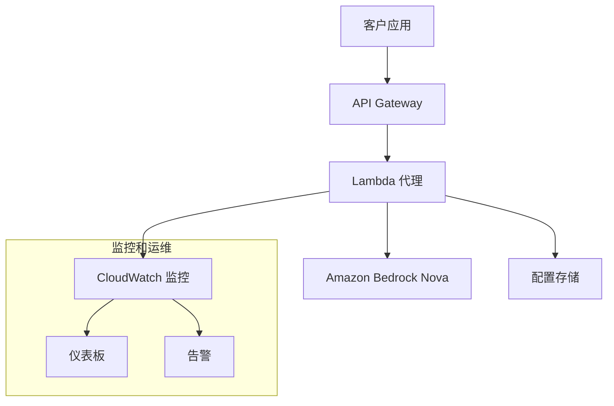

# Bedrock Nova Proxy

🚀 **OpenAI 兼容的 Amazon Bedrock Nova 代理服务** - 零代码迁移，节省 60-80% API 成本

[](https://opensource.org/licenses/MIT)
[](https://www.python.org/downloads/)
[](https://aws.amazon.com/bedrock/)

## 🌟 核心特性

- **🔄 零代码迁移**：完全兼容 OpenAI API，只需更改 base_url
- **💰 成本优化**：相比 OpenAI API 节省 60-80% 成本
- **🚀 高性能**：基于 AWS Lambda 的无服务器架构
- **🛡️ 企业级安全**：IAM 集成、VPC 支持、端到端加密
- **📊 完整监控**：CloudWatch 指标、仪表板、告警
- **🌐 多模态支持**：文本 + 图像输入
- **⚡ 流式响应**：实时流式输出
- **🏢 客户部署**：一键部署到客户环境

## 🎯 快速开始

### 1. 部署服务

```bash
# 克隆仓库
git clone https://github.com/YOUR_USERNAME/bedrock-nova-proxy.git
cd bedrock-nova-proxy

# 配置客户信息
cp config/customer-example.yaml config/my-company.yaml
# 编辑 config/my-company.yaml，设置您的公司名称和 AWS 账户信息

# 一键部署
./deployment/deploy-customer.sh --config config/my-company.yaml
```

### 2. 更新应用代码

```python
# 原来的 OpenAI 代码
from openai import OpenAI
client = OpenAI(api_key="your-openai-key")

# 更新后的代码（只需改一行！）
client = OpenAI(
    base_url="https://your-api-endpoint",  # 部署后获得的端点
    api_key="dummy"  # 不使用，但客户端需要
)

# 其他代码完全不变！
response = client.chat.completions.create(
    model="gpt-4o-mini",  # 用户调用 OpenAI 模型名
    messages=[{"role": "user", "content": "Hello!"}]
)
# 代理自动将 gpt-4o-mini 映射到 eu.amazon.nova-lite-v1:0 并调用
```

## 📋 模型映射

**当前配置：所有模型统一映射到 Nova Lite（EU区域）以优化成本**

| 用户调用的模型 | 实际调用的模型 | 用途 | 成本优势 |
|-------------|-----------|------|----------|
| `gpt-3.5-turbo` | `eu.amazon.nova-lite-v1:0` | 统一使用 Nova Lite | 成本优化 |
| `gpt-4o-mini` | `eu.amazon.nova-lite-v1:0` | 统一使用 Nova Lite | 成本优化 |
| `gpt-4o` | `eu.amazon.nova-lite-v1:0` | 统一使用 Nova Lite | 大幅成本节省 |
| `gpt-4` | `eu.amazon.nova-lite-v1:0` | 统一使用 Nova Lite | 大幅成本节省 |
| `gpt-4-turbo` | `eu.amazon.nova-lite-v1:0` | 统一使用 Nova Lite | 大幅成本节省 |

> **工作原理**：
> - 用户在代码中使用熟悉的 OpenAI 模型名称（如 `gpt-4o-mini`）
> - 代理自动将这些模型名映射到 `eu.amazon.nova-lite-v1:0`
> - 实际的 API 调用发送到 Amazon Bedrock Nova Lite 模型
> - 当前配置优先考虑成本优化，如需不同性能级别，可在配置中调整映射关系

## 🏗️ 架构概览



## 📦 部署选项

### 🔥 无服务器部署（推荐）
- **组件**：API Gateway + Lambda
- **优势**：自动扩缩容，按需付费
- **适用**：大多数场景

```bash
./deployment/deploy-customer.sh --config config/my-company.yaml --type serverless
```

### 🐳 容器化部署
- **组件**：ECS/EKS + ALB
- **优势**：高吞吐量，可预测性能
- **适用**：大规模生产环境

```bash
./deployment/deploy-customer.sh --config config/my-company.yaml --type container
```

### 🔀 混合部署
- **组件**：根据工作负载混合使用
- **优势**：灵活性最高
- **适用**：复杂企业环境

## 🛡️ 安全特性

- **🔐 IAM 集成**：无需管理 API 密钥
- **🌐 VPC 支持**：私有网络部署
- **🔒 端到端加密**：TLS 1.3 + KMS
- **📋 审计日志**：完整的请求追踪
- **🚫 IP 白名单**：访问控制

## 📊 监控和运维

### CloudWatch 仪表板
- Lambda 性能指标
- API Gateway 流量统计
- Bedrock 调用分析
- 成本趋势分析

### 自动告警
- 错误率超阈值
- 响应时间异常
- 成本预算告警
- 服务可用性监控

## 💰 成本分析

### 典型月度成本对比

| 服务 | OpenAI API | Bedrock Nova | 节省 |
|------|------------|--------------|------|
| 100万 tokens (GPT-4o) | $5,000 | $800 | 84% |
| 100万 tokens (GPT-4o-mini) | $150 | $200 | -33% |
| 100万 tokens (GPT-3.5-turbo) | $1,500 | $350 | 77% |

**额外 AWS 成本**：
- Lambda: ~$20-50/月
- API Gateway: ~$3.50/百万请求
- CloudWatch: ~$5-10/月

## 📚 文档

- [📖 完整部署指南](docs/Customer-Deployment-Guide.md)
- [🚀 5分钟快速部署](docs/Quick-Start-Customer-Deployment.md)
- [🔄 迁移指南](docs/Migration-Guide.md)
- [🔧 故障排除](docs/Troubleshooting.md)
- [📊 使用说明](docs/Usage.md)

## 🧪 测试

```bash
# 运行单元测试
cd lambda_proxy
python -m pytest tests/ -v

# 运行集成测试
python test_bedrock_integration.py
python test_models_integration.py
python test_monitoring_integration.py

# 性能测试
python scripts/performance-test.py https://your-api-endpoint
```

## 🤝 贡献

欢迎贡献代码！请查看 [贡献指南](CONTRIBUTING.md)。

### 开发环境设置

```bash
# 克隆仓库
git clone https://github.com/YOUR_USERNAME/bedrock-nova-proxy.git
cd bedrock-nova-proxy

# 创建虚拟环境
python -m venv venv
source venv/bin/activate  # Linux/Mac
# 或 venv\Scripts\activate  # Windows

# 安装依赖
pip install -r lambda_proxy/requirements.txt
pip install -r requirements-dev.txt

# 运行测试
python -m pytest
```

## 📄 许可证

本项目采用 MIT 许可证 - 查看 [LICENSE](LICENSE) 文件了解详情。

## 🆘 支持

- **📖 文档**：查看 `docs/` 目录下的详细文档
- **🐛 问题报告**：[GitHub Issues](https://github.com/YOUR_USERNAME/bedrock-nova-proxy/issues)
- **💬 讨论**：[GitHub Discussions](https://github.com/YOUR_USERNAME/bedrock-nova-proxy/discussions)

## 🎯 路线图

- [ ] 支持更多 Bedrock 模型
- [ ] 添加缓存层
- [ ] 支持批量请求
- [ ] 多区域部署
- [ ] Kubernetes Helm Charts
- [ ] Terraform 模块

## ⭐ Star History

如果这个项目对您有帮助，请给我们一个 Star！

[](https://star-history.com/#YOUR_USERNAME/bedrock-nova-proxy&Date)

---

**🚀 立即开始您的 OpenAI 到 Bedrock Nova 迁移之旅！**# bedrock-proxy
